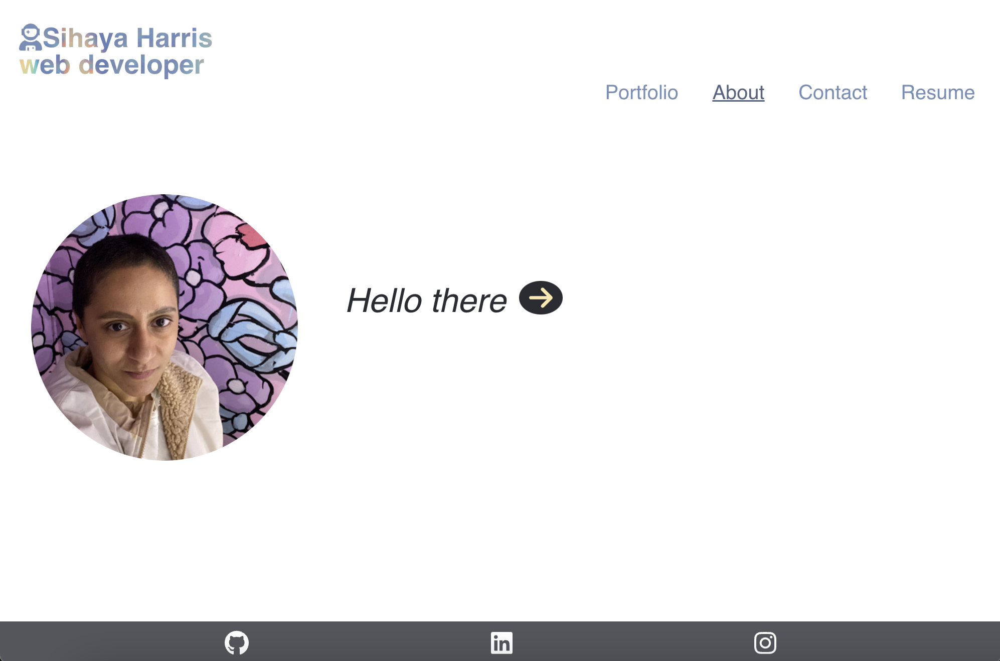
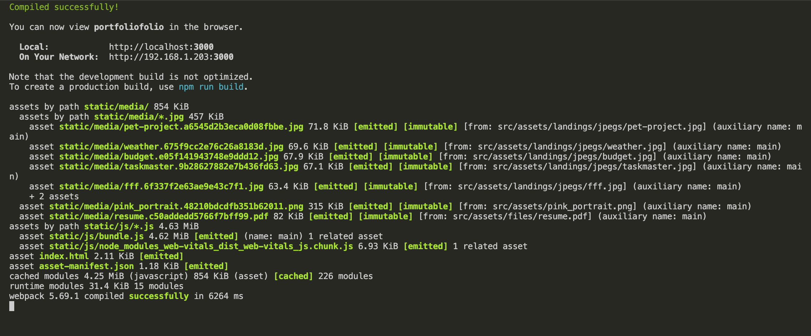
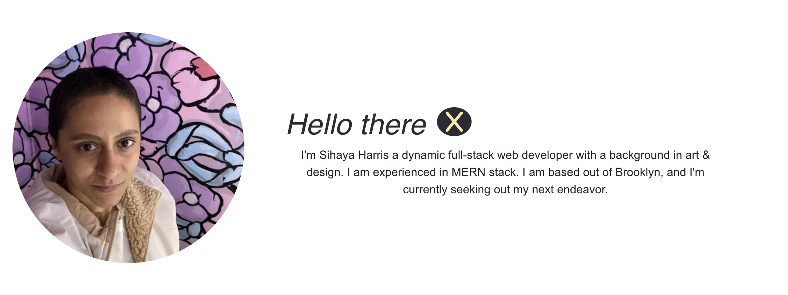
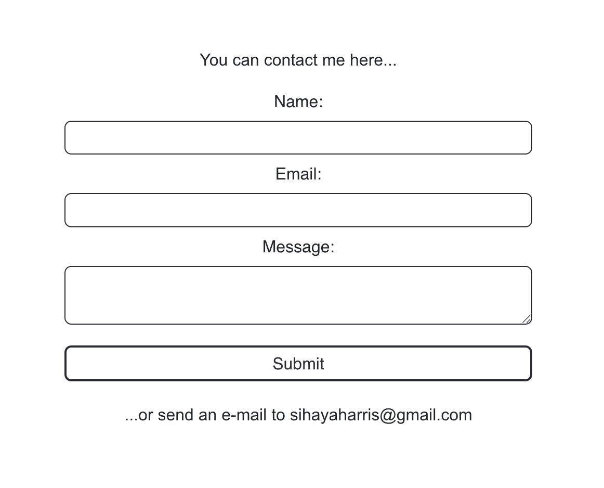
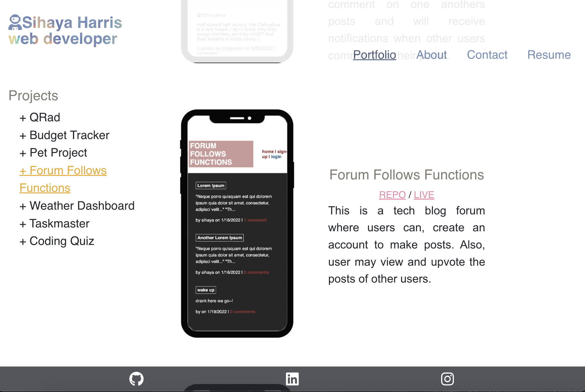

# Portfolio
  
  
   
  
                      
   

  ## TABLE OF CONTENTS

  

  [Description](#description) *
  [Prerequisites](#prerequisites) *
  [Installation](#installation) *
  [Usage](#usage) *
  [Questions](#questions) *
  [License](#license)

   

    
  
   

  ## Description

  This a portfolio of all of my most recent web development work, built with React.
   
  Live: https://portfoliofolioolio.herokuapp.com/
   
  Repo: https://github.com/sihayah/portfoliofolio

 

  ## Prerequisites

  Make sure you have the following installed on your development machine:

  Git - [Download & Install Git](https://git-scm.com/downloads)
   
  Node.js - [Download & Install Node.js](https://nodejs.org/en/download/)
   
  Visual Studio Code - [Download & Install VS Code](https://code.visualstudio.com/download)

  

  ## Installation

  To demo this app via browser navigate to https://portfoliofolioolio.herokuapp.com/.

  To demo locally, clone the repo. Navigate to the root of the repo in command line. Run npm install to install all dependencies:

    npm install

  Once installed, you can start the app from the command line, as follows:

    npm start

  If it's running the following response should occur in your command line...

    

  Then a browser window should automatically open. If not, navigate to http://localhost:3000 to view the app.

   

  ## Usage 

  A menu is available to the user (top of screen for wider screen formats, or hamburger sidebar for smaller and mobile). From there, the sections of the site can be selected and viewed. 

  Links to my GitHub, LinkedIN, and Instagram are fixed to the bottom of the page.

  From the About section a dropdown menu is available to view a short bio via an arrow, button.
  Once opened it can be X'd out.

  

  The contact form can be used to me (I will receive and email from all form submissions).

   

  The portfolio can be navigated from a table of contents.

   

   

  ## Questions

  

  For any further inquiries, please contact me via gitHub: [(sihayah)](https://github.com/sihayah) or email: sihayaharris@gmail.com

   

  

  ## License

  
  
  [click here for more information about ISC license.](https://opensource.org/licenses/ISC)
  

   
   
