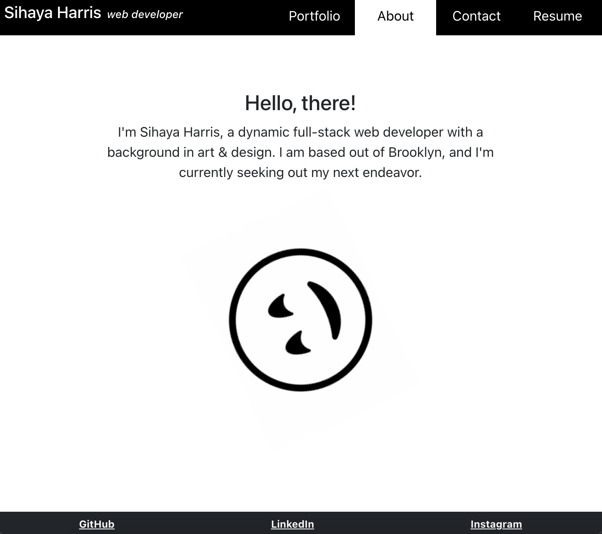

# Portfolio
  
  
   
  
                      
   

  ## TABLE OF CONTENTS

  

  [Description](#description) *
  [Questions](#questions) *
  [License](#license)

   

    
  
   

  ## Description

  

  React web development porfolio
   
  Deployment: (https://portfoliofolioolio.herokuapp.com/)
   
  Repo: (https://github.com/sihayah/portfoliofolio)

  ## Questions

  

  For any further inquiries, please contact me via gitHub: [(sihayah)](https://github.com/sihayah) or email: sihayaharris@gmail.com

   

  

  ## License

  
  
  [click here for more information about ISC license.](https://opensource.org/licenses/ISC)
  

   
   
